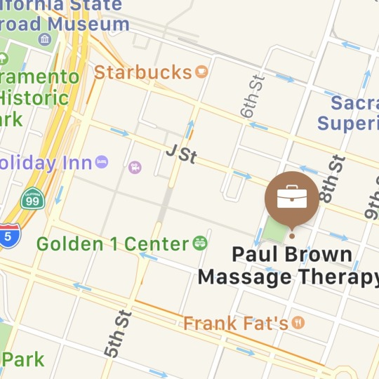

I am so pleased to announce that Paul Brown Massage Therapy Pain Relief Center has moved back to its original Sacramento location in the beautiful and historic Ochsner Building at 717 K Street, directly across the street from the east entrance to the Golden One Center!

I’m on the pedestrian block of K Street, between 7th and 8th Streets, and there is plenty of metered street parking, as well as four garages within one block of my location!

As well, **[SacRT’s](http://sacrt.com/tripplanning3.stm)** 7th and K Light Rail Station is right there for your public transit needs, as well as several bus lines!  

I’m looking forward to serving you in my larger, more private space!

## [**BOOK NOW**](http://paulbrownmassagetherapy.fullslate.com)
