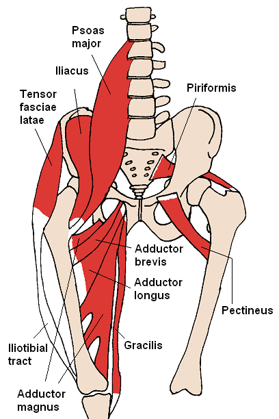
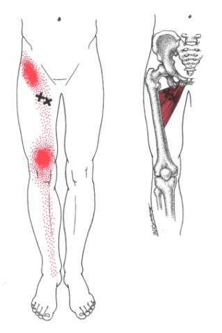
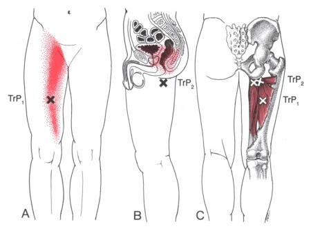
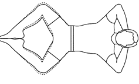

When we think about the hips, the muscles we most often thing of are the glutes, hamstrings, and quads, right?  But there’s an other group of hip muscles we often overlook - the hip adductors.

The five muscles that make up the adductors - Adductor brevis, adductor longus, adductor magnus, gracilis, and pectineus are responsible for bring the hip into adduction - that is, moving the femur medially (toward the centerline of the body)  But they do a lot more than that!  The adductors are also postural stabilizers during walking and running.  They keep the leg from swinging wildly outward, which allows for normal gait and knee stability.  They also help stabilize the hip and back by allowing for anterior and posterior tiltin of the pelvis.  So you can see that they are important muscles.

## **When Pain Strikes**

The adductor longus and brevis are the most commonly injured adductor muscles, and refer pain to the upper thigh and knee, as see in this illustration.  You can sometimes experience pain all the way down to the ankle from adductor longus or brevis trigger points.  

The adductor magnus also creates the classic “groin injury” but also rectal or vaginal pain, or pain in the anal area, painful intercourse, sometimes happens.  Fortunately, the adductor magnus is fairly easily treated without being terribly intrusive.

## **Treatment Options**  

Massage is an excellent treatment option, especially if you are a runner or are otherwise active - like you’re a long distance driver, or weightlifter, or do track, or wrestle, or any number of other physical activities.  Treating trigger points in the groin area can be challenging to do yourself, but with a trained therapist, it’s relatively easy to do so in a way that is comfortable and respectful.

For some self treatment options, the number one thing is rest.  Allowing a groin injury to fully heal is the best way to ensure that the injuries do not build upon each other. Heat, and gentle stretching are also important tools for healing from a groin injury.  

The most gentle stretch is the supine groin stretch:

lay on your back, put the soles of your feet together, and let your knees fall gently open.  Hold this position for 30-60 seconds each time, breathing into your belly, and letting your legs become more heavy with each exhalation.

You can **[book a session with me](http://paulbrownmassagetherapy.fullslate.com)** and get relief from your groin pain.
