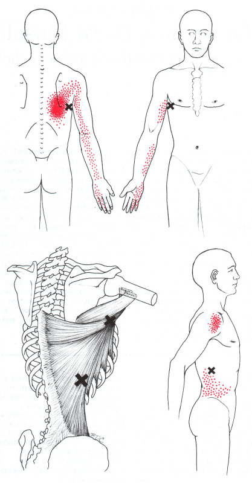

That deep persistent pain right at the base of the shoulder blade is something at many people experience, especially if they are computer/desk workers.  Long hours of flexing the shoulders, holding the arms in front of the body, can take its toll on the **Latissimus Dorsi** muscles.

The latissimus dorsi, which means widest part of the back, is that thick muscle that gives us that pleasing “V” shape when seen from behind.  It originates on the iliac crest and thoracolumbar aponeurosis (a wide, thick field of connective tissue on our sacrum, ilium, lumbar spine and thoracic spine), continues over the inferior angle of the scapula, and inserts on the proximal anterior head of the humerus and intertubercular groove of the humerus.  The lats perform several actions: adduction, extension, medial rotation of the shoulder (glenohumeral) joint; and adduction, downward rotation, and depression of the scapular.  So  you can see, it’s a busy muscle!

If you look at that illustration, you can see the “X” marks the location of trigger points, and the red stippling indicates where pain is mostly likely to be a cause of lat trigger points.  You can see that that the pain is concentrated right around the mid back, but can refer all the way down the arm to the fourth and fifth fingers, as well as on the ribs.

Fortunately, there are good treatment options - myofascial release and trigger point massage are both excellent options for helping with latissimus dorsi trigger points.  The trigger points are easily accessible and relative easy to deactivate.

There are also some good self-care options: [TriggerPoint GRID Foam Roller with Free Online Instructional Videos, Original (13-inch), Lime](https://www.amazon.com/gp/product/B008YPZQCU/ref=as_li_tl?ie=UTF8&camp=1789&creative=9325&creativeASIN=B008YPZQCU&linkCode=as2&tag=pbmt03-20&linkId=fab84cae660e9e9a3e4be86769370658) can bring some relief, as well as a self-massage tool like a [Thera Cane.](https://www.amazon.com/gp/product/B000PRMCJU/ref=as_li_tl?ie=UTF8&camp=1789&creative=9325&creativeASIN=B000PRMCJU&linkCode=as2&tag=pbmt03-20&linkId=a400c07a22d20fb62e3025b8b8ac64cc)  

If you are in the Sacramento area, **[book an appointment today](http://paulbrownmassagetherapy.fullslate.com)** and get relief from your lat pain!
